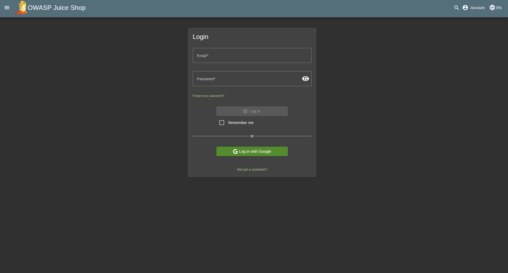
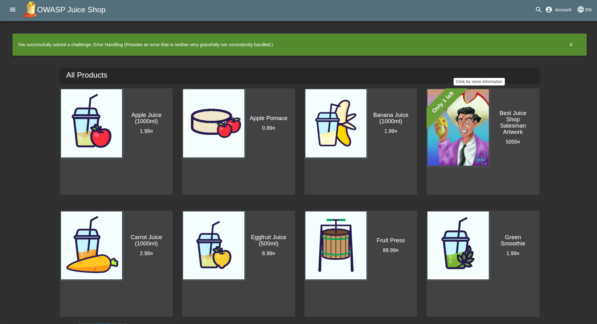
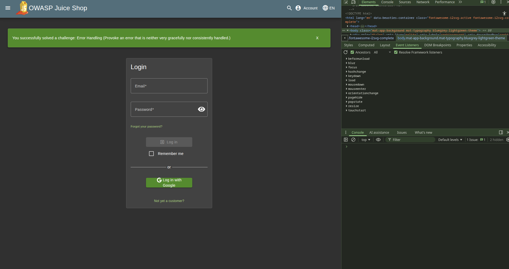

# Triage Report — OWASP Juice Shop

## Scope & Asset
- Asset: OWASP Juice Shop (local lab instance)
- Image: bkimminich/juice-shop:v19.0.0
- Release link/date: https://github.com/juice-shop/juice-shop/releases/tag/v19.0.0 — 2023-10-31
- Image digest (optional): <sha256:2765a26de7647609099a338d5b7f61085d95903c8703bb70f03fcc4b12f0818d.>

## Environment
- Host OS: Ubuntu 22.04
- Docker: 29.2.0

## Deployment Details
- Run command used: `docker run -d --name juice-shop -p 127.0.0.1:3000:3000 bkimminich/juice-shop:v19.0.0`
- Access URL: http://127.0.0.1:3000
- Network exposure: 127.0.0.1 only [x] Yes  [ ] No  (explain if No)

## Health Check
- Page load: attach screenshot of home page (path or embed)
- API check: first 5–10 lines from `curl -s http://127.0.0.1:3000/rest/products | head`

## Surface Snapshot (Triage)
- Login/Registration visible: [x] Yes  [ ] No — notes: 
- Product listing/search present: [x] Yes  [ ] No — notes: 
- Admin or account area discoverable: [ ] Yes  [x] No — notes: <...>
- Client-side errors in console: [ ] Yes  [x] No — notes: 
- Security headers (quick look — optional): `curl -I http://127.0.0.1:3000`  
  - CSP: **Not present** 
  - HSTS: **Not present**
  - X-Frame-Options: SAMEORIGIN ✓
  - X-Content-Type-Options: nosniff ✓
  - Feature-Policy: payment 'self' ✓>

## Risks Observed (Top 3)
1) **SQL Injection in authentication form** - Login to admin account using SQL Injection ' OR 1=1-- 
2) **Reflected Cross-Site Scripting (XSS)** — Search functionality reflects user input without proper encoding, allowing JavaScript execution via payloads like `<svg onload=alert(1)>`
3) **Broken Access Control** - allowsto view others' shopping carts by simply changing the cart ID in API requests while using their own valid authentication token, bypassing ownership checks

## GitHub Community
Starring repositories in open source signals appreciation, helps with project discovery, and bookmarks interesting work for future reference. Following developers enables learning from their contributions, builds professional networks, and facilitates collaboration on team projects.